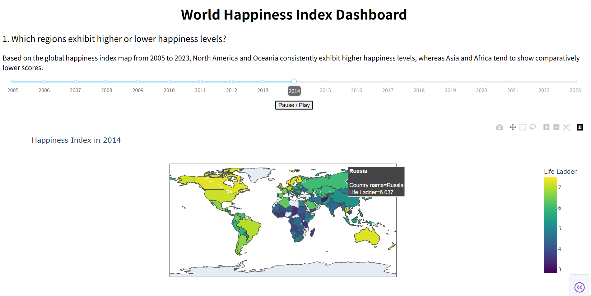
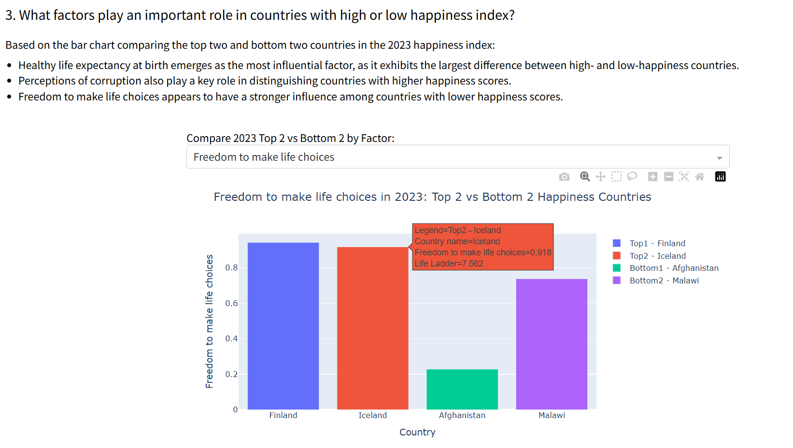

# 🌍 World Happiness Index Dashboard

An interactive data visualization dashboard built with Python and Dash to analyze global happiness trends and examine how different influencing factors relate to happiness levels across countries and regions over time.

---

## 📌 Project Overview

This project explores global happiness trends using data from the **World Happiness Report (2005–2023)**.  
The dashboard is designed to support interactive exploration of happiness scores across countries, regions, and years.

The analysis focuses on the following key questions:
1. Which regions exhibit higher or lower happiness levels?
2. How are different influencing factors related to the happiness index?
3. Which factors play a more significant role in countries with relatively high or low happiness levels?

Through interactive maps, scatter plots, line charts, and bar charts, users can explore both regional patterns and factor-level relationships in an intuitive and dynamic way.

---

## 📊 Data Visualizations

Below are example visualizations generated by the dashboard:

- **Global Happiness Index over Time**  
  

- **Happiness Index vs. Influencing Factors**  
  

- **Influencing Factors in Top and Bottom Happiness Countries (2023)**  
  

---

## 🧠 Influencing Factors Included

The analysis incorporates the following eight factors from the World Happiness dataset:

- Log GDP per capita  
- Social support  
- Healthy life expectancy at birth  
- Freedom to make life choices  
- Generosity  
- Perceptions of corruption  
- Positive affect  
- Negative affect  

---

## 🛠️ Tools & Technologies

- Python  
- Pandas  
- Plotly  
- Dash  

---

## 📂 Data Source

Publicly available datasets were used for this project:

- **World-happiness-report-updated_2024.csv**  
- **UN_Region_Categories.csv**

The data was downloaded from public online sources and used for educational purposes only.

---

## 📝 Description

This project includes data cleaning, exploratory data analysis (EDA), and interactive visualization to examine country-level and temporal trends in happiness indicators.  
The dashboard enables year-based filtering and comparative analysis to support interactive data exploration and insight generation.

---

# ▶️ How to Run

1. Clone the repository
```bash
git clone https://github.com/RuyiGai/happiness-data-analysis-dashboard.git
cd happiness-data-analysis-dashboard
```

2. Install dependencies
```bash
pip install -r requirements.txt
```

4. Run the dashboard
- Open happiness_Index.ipynb in Jupyter Notebook and run all cells.

5. View the dashboard
- Open your browser and visit: http://127.0.0.1:8050


